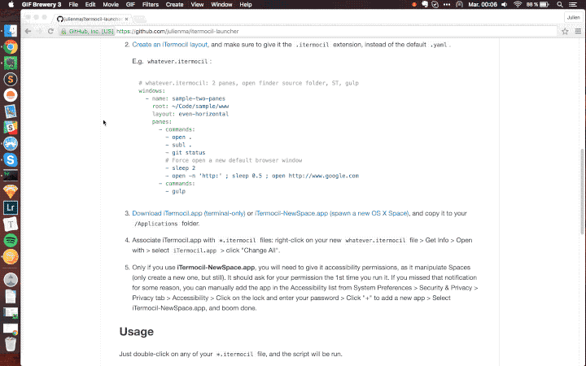

# Workspace Wizard

*See the blog post [Enough Friction to Kill Your Momentum](http://tilyoumake.it/things/momentum).*

---

This launcher turns [iTermocil](https://github.com/TomAnthony/itermocil) scripts into clickable shortcuts. This means you can run these scripts *without even being* in your terminal. The whole point for iTermocil being to open that terminal for me.

That's an Automator app, which just takes a `*.itermocil` file as an argument, optionally creates a new OS X Space, and opens the terminal commands thanks to iTermocil.

> iTermocil allows you to setup pre-configured layouts of windows and panes in iTerm2, having each open in a specified directory and execute specified commands. You do this by writing YAML files.




## Install

1. [Install iTermocil](https://github.com/TomAnthony/itermocil#installing-itermocil). Make sure you use at least v0.2.1:

   ```sh
    itermocil --version
    # 0.2.1
   ```

2. [Create an iTermocil layout](https://github.com/TomAnthony/itermocil#examples), and make sure to give it the `.itermocil` extension, instead of the default `.yaml`.

    E.g. `whatever.itermocil`:

   ```yaml
    # whatever.itermocil: 2 panes, open finder source folder, ST, gulp
    windows:
      - name: sample-two-panes
        root: ~/Code/sample/www
        layout: even-horizontal
        panes:
          - commands:
            - open .
            - subl .
            - git status
            # Force open a new default browser window
            - sleep 2
            - open -n 'http:' ; sleep 0.5 ; open http://www.google.com
          - commands:
            - gulp
   ```

3. [Download iTermocil.app (terminal-only)](https://github.com/julienma/itermocil-launcher/releases/download/v0.2.0/iTermocil-v0.2.0.zip) or [iTermocil-NewSpace.app (spawn a new OS X Space)](https://github.com/julienma/itermocil-launcher/releases/download/v0.2.0/iTermocil-NewSpace-v0.2.0.zip), and copy it to your `/Applications` folder.

4. Associate iTermocil.app with `*.itermocil` files: right-click on your new `whatever.itermocil` file > Get Info > Open with > select `iTermocil.app` > click "Change All".

5. Only if you use **iTermocil-NewSpace.app**, you will need to give it accessibility permissions, as it manipulate Spaces (only create a new one, but still). It should ask for your permission the 1st time you run it. If you missed that notification for some reason, you can manually add the app in the Accessibility list from System Preferences > Security & Privacy > Privacy tab > Accessibility > Click on the lock and enter your password > Click "+" to add a new app > Select iTermocil-NewSpace.app, and boom done.

## Usage

Just double-click on any of your `*.itermocil` file, and the script will be run.

If you're using the iTermocil-NewSpace.app, it will also spawn a brand new OS X Space, so all the apps (IDE, Browser, Finder, etc.) related to your project, which will be opened by your iTermocil script, will be grouped together.

## Create your own Automator app

If you don't want to use the provided .app, you can create it yourself from scratch.

Open Automator, create a new Application.

Add an Applescript step:

```
on run {input, parameters}
    tell application "System Events"
        --mission control starten
        do shell script "/Applications/Mission\\ Control.app/Contents/MacOS/Mission\\ Control"
        tell process "Dock"
            set countSpaces to count buttons of list 1 of group 1
            --new space
            click button 1 of group 1
            --switch to new space
            repeat until (count buttons of list 1 of group 1) = (countSpaces + 1)
            end repeat
            click button (countSpaces + 1) of list 1 of group 1
        end tell
    end tell
    return input
end run
```

Then add a Shell script step with these parameters:
- shell: `/bin/bash`
- input: arguments
- code:

```sh
export PATH=/usr/local/bin:$PATH
itermocil --layout $1
```

Finally, save as an .app, copy a nice custom icon (like [this one](https://dribbble.com/shots/1343859-iTerm2-Icon)), and profit.

---

## Credits

- iTerm2 Icon by [Dax Hansen](https://dribbble.com/shots/1343859-iTerm2-Icon).
- AppleScript to open a new Space by [Montaldo](http://stackoverflow.com/a/29176079/1907212).
